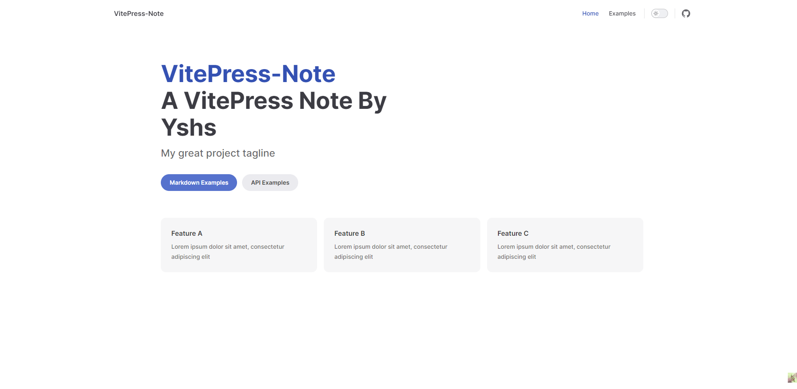
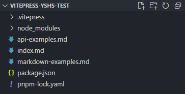
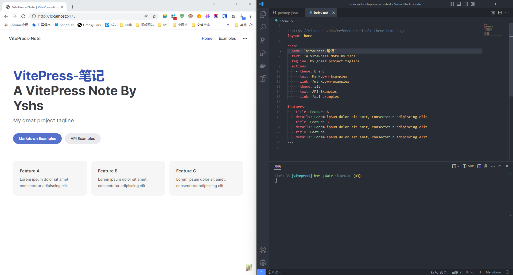
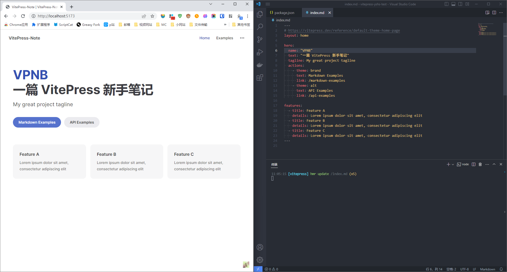
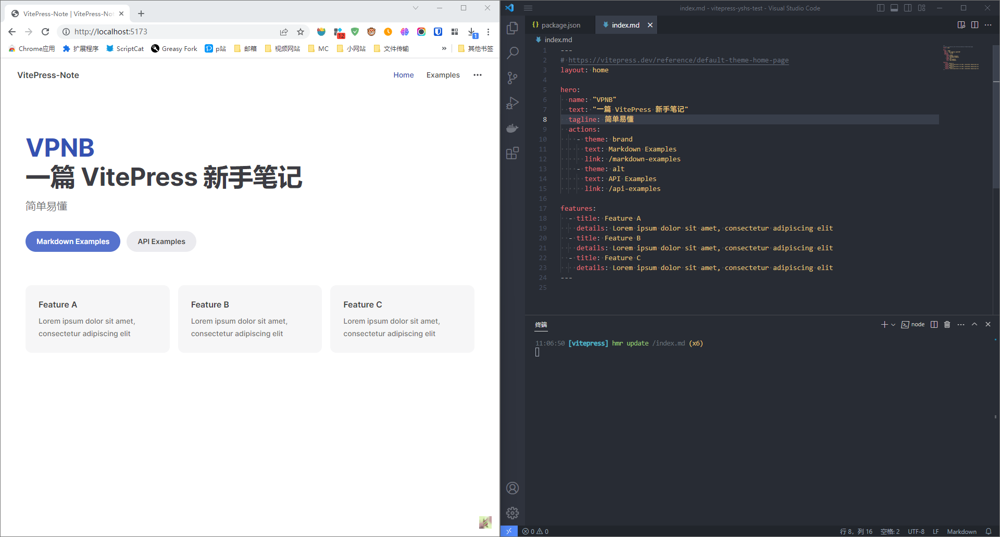
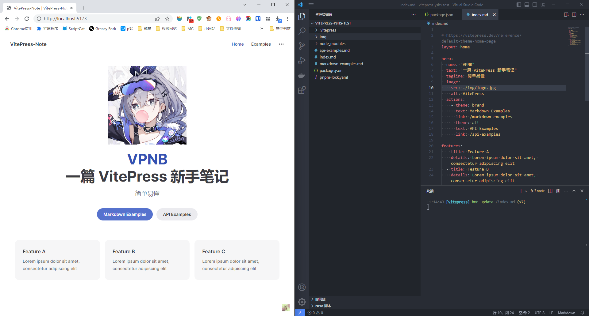
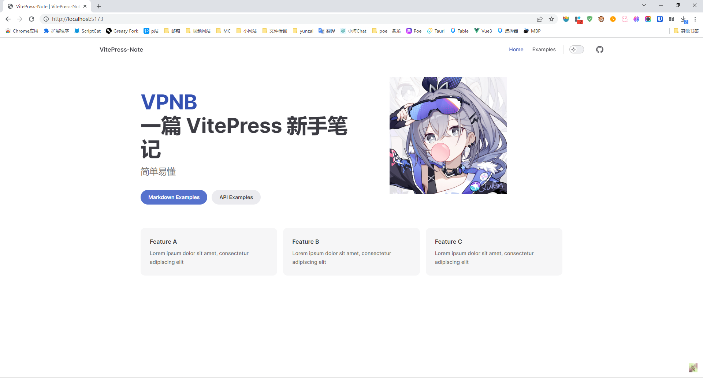
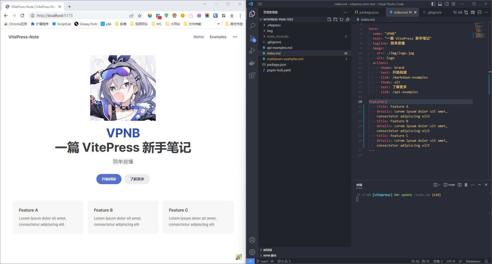
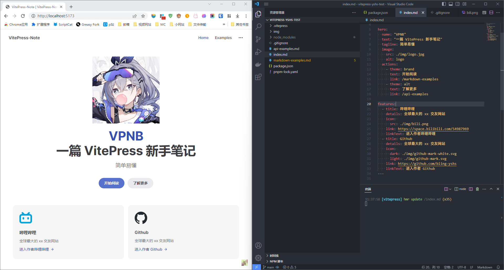

# VitePress-GithubPages-Note

VitePress-GithubPages-Note，搭建 VitePress 并部署到 Github Pages 的新手踩坑笔记
> 教程所用版本 `1.0.0-rc.20`

## 前言

这节课太无聊了，逃回宿舍整点好玩的。本来想搭建 VuePress 的，结果发现 VuePress 出了 v2 版本，然后看了看它的仓库，居然更推荐 VitePress，索性就部署 VitePress 得了，VitePress 使用 Vue3，正好 Vue3 我也更熟悉（后来才发现几乎用不到 Vue3）

## 搭建 VitePress

### 查阅官方文档

英文文档 [https://vitepress.dev/guide/getting-started](https://vitepress.dev/guide/getting-started)

> 中文文档 =>=>=> 居然没有？？？我靠作为一个国人项目居然没有官方中文文档，实在是令我震惊，算了用翻译软件凑活下吧

### 在线预览

官方有一个 [在线预览](https://vitepress.new/) 的地址，我先看一眼

> 这个地址居然对浏览器版本有要求，我用 102 的内核居然会崩溃

试了一下暗色模式切换很丝滑，就是内置的条目只有一条，这演示个啥呀，鉴定为不会写演示的

不管了还是自己上手试一下吧

### 环境

[Node.js](https://nodejs.org/en) 18 或以上版本

### 安装

创建文件夹

```bash
mkdir vitepress-test
```

进入

```bash
cd vitepress-test
```

安装 vitepress

```bash
pnpm add -D vitepress
```

运行初始化程序

```bash
pnpm dlx vitepress init
```

> `Where should VitePress initialize the config?`

这，直接当前目录把，他默认也是 `./`

> `Site title:`

网站标题，就这篇笔记吧，那就 VitePress-Note

> `Site description:`

感觉不重要，直接随便写点吧 A VitePress Note By Yshs

>  ```bash
>  Theme:
>  ● Default Theme (Out of the box, good-looking docs)
>  ○ Default Theme + Customization
>  ○ Custom Theme
> ```

主题的话，就默认推荐的吧

> `Use TypeScript for config and theme files?`

TypeScript，那肯定要加上

> `Add VitePress npm scripts to package.json?`

npm 脚本那肯定也要呀

ok 这样就部署好了，提示我

```bash
pnpm run docs:dev
```

ok，VitePress，启动！

经典的 [http://localhost:5173/](http://localhost:5173/)



看着还挺不错的，先改一改主页吧，我可是要写中文文档的

### 目录结构

我之前多少了解过一点这方面的知识，好像这种框架都是自动解析 markdown 文件来生成的网页，先来看看目录结构吧



好随意！不过感觉应该也是可以自己创建文件夹分类的，所以问题不大

### 修改主页

也就是修改 index.md

```markdown
---
# https://vitepress.dev/reference/default-theme-home-page
layout: home

hero:
  name: "VPGPN"
  text: "一篇 VitePress & Github Pages 新手笔记"
  tagline: 简单易懂
  image:
    src: ./img/logo.jpg
    alt: logo
  actions:
    - theme: brand
      text: VitePress 笔记
      link: /vitepress/start
    - theme: alt
      text: Github Pages 笔记
      link: /github-pages/start

features:
  - title: 哔哩哔哩
    details: 全球最大的 xx 交友网站
    icon: 
      src: ./img/bili.png
    link: https://space.bilibili.com/54987969
    linkText: 进入作者哔哩哔哩
  - title: Github
    details: 全球最大的 xx 交友网站
    icon: 
      dark: ./img/github-mark-white.svg
      light: ./img/github-mark.svg
    link: https://github.com/bling-yshs
    linkText: 进入作者 Github
---

```

|元素|说明|备注|
|---|---|---|
|layout|看了下文档好像指的是布局，有 doc，page，home 三种，这个是主页的 md，所以写的是 home||
|hero|应该是一个代表顶层元素标签吧，也不知道为什么要取这个名字，应该是某种习惯||
|name|最上方的蓝色标题，一般是项目名称||
|text|蓝色标题下方的大标题，一般是阐述项目的主要功能||
|tagline|大标题下方的小字，一般是阐述项目的特点||
|image|项目 logo，默认没有，我随便加个试试| 居然还有响应式 |
|action|主页的按钮，brand 是主按钮，alt 是次按钮||
|features|下面的卡片，太多了自己看吧，文档写的挺清楚的，都挺简单的||

### 修改主体

也就是修改 `./vitepress/config.mts` 话说为什么是 `.mts`，没见过的格式

```ts
import { defineConfig } from 'vitepress'

// https://vitepress.dev/reference/site-config
export default defineConfig({
  title: "VPGPN",
  description: "一篇 VitePress 新手笔记",
  themeConfig: {
    // https://vitepress.dev/reference/default-theme-config
    nav: [
      { text: '主页', link: '/' },
      { text: 'VitePress', link: '/vitepress' }
    ],

    sidebar: [
      {
        text: '介绍',
        collapsed: false,
        items: [
          { text: '介绍', link: '/introduce/introduce' },

        ]
      },
      {
        text: 'VitePress',
        collapsed: false,
        items: [
          { text: '开始', link: '/vitepress/start' }
        ]
      }
    ],
    socialLinks: [
      { icon: 'github', link: 'https://github.com/bling-yshs/VitePress-GithubPages-Note' }
    ],
    search: {
      provider: 'local',
    },
  }
})

```

|元素|说明|备注|
|---|---|---|
|title|网页选项卡上的标题||
|description|说明，不知道有啥用||
|themeConfig|主题配置||
|-nav|主页右上角的选项，link 代表跳转的地址||
|-sidebar|侧边栏相关布局，小项目的话其实没必要拆的很细||
|--collapsed|存在则让当前侧边栏可以折叠|false 代表默认展开，true 代表默认折叠|
|--items|text: 每一个小项的标题；link: 到具体的本地 markdown 文件的地址|例如：`{ text: '开始', link: '/vitepress/start' }` 就是创建一个叫开始的选项，点击这个选项可以跳转到 `./vitepress/start.md` 文件生成的网页|
|-socialLinks|右上角的外链图标||
|-search|存在则显示搜索框||

## 部署到 Github Pages

### 一些想法

在我查看样例的时候，发现很多时候这种文档都是在项目底下新建一个名为 docs 的文件夹，然后让 Github Actions 自动部署的，我也试试吧

###
