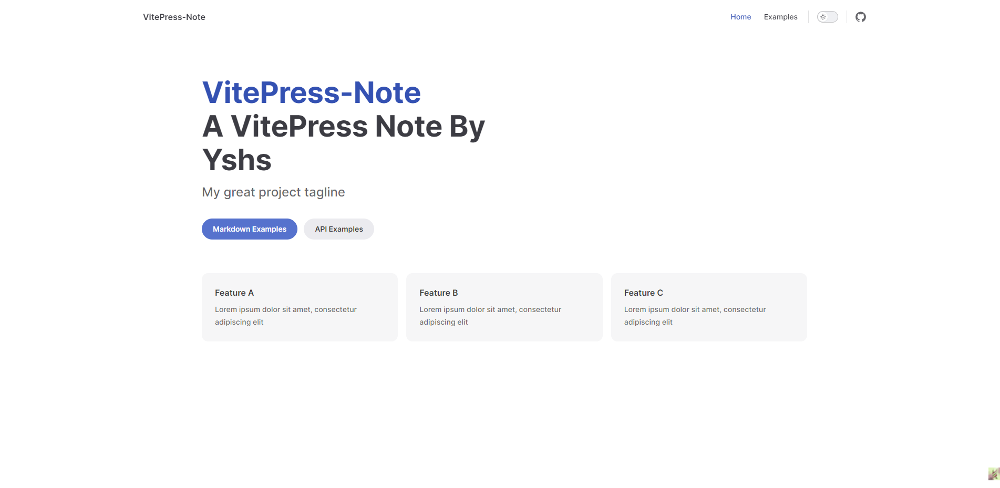
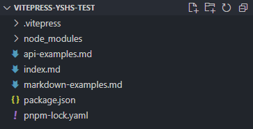
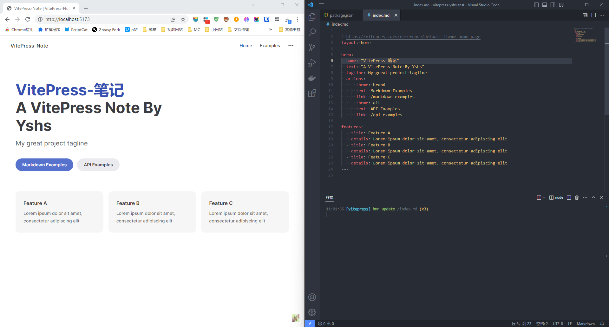
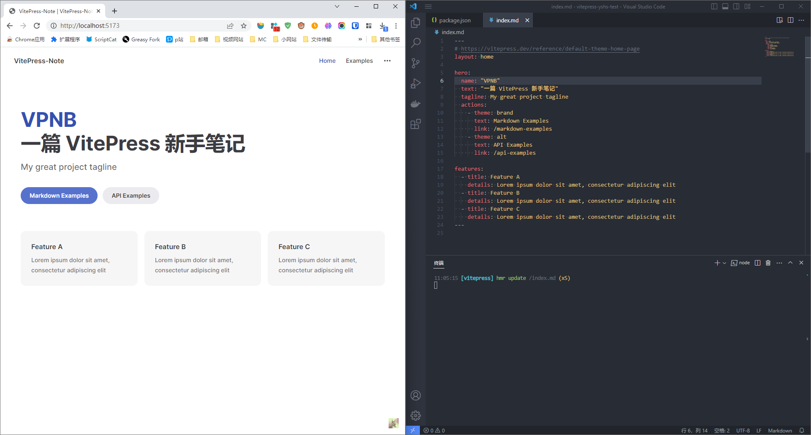
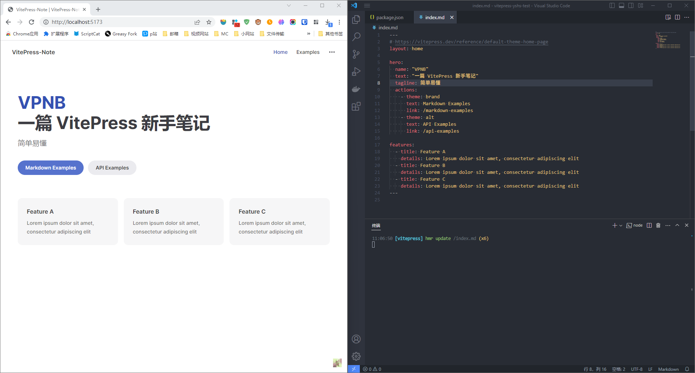
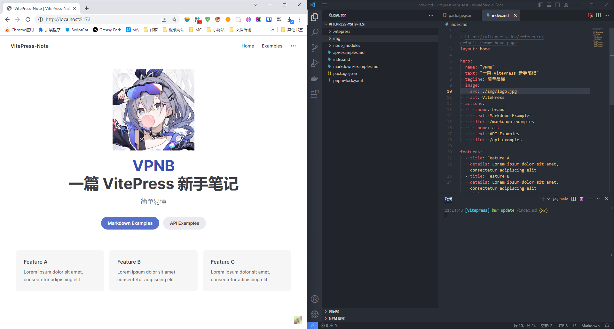
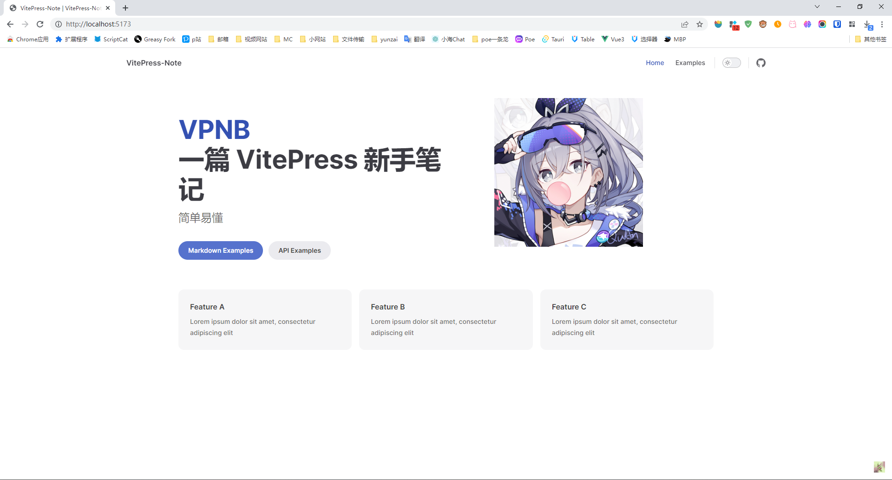
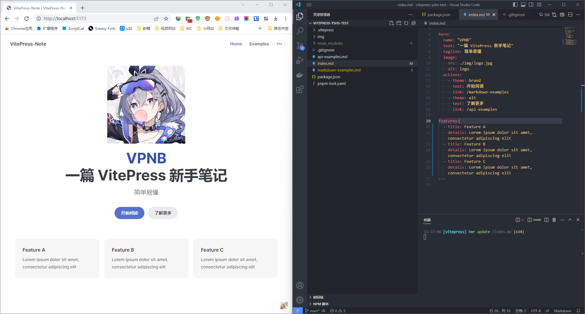
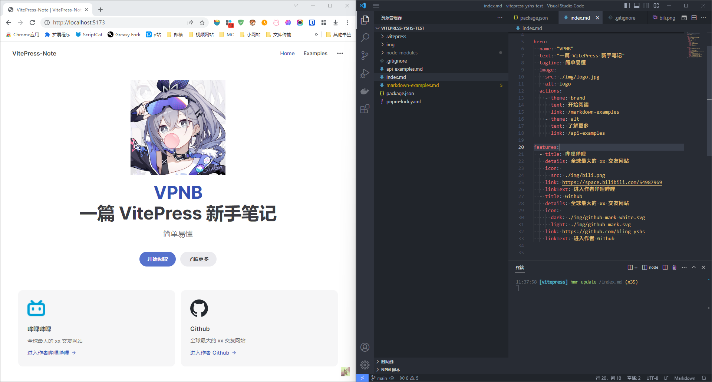

# VitePress

## 查阅官方文档

英文文档 [https://vitepress.dev/guide/getting-started](https://vitepress.dev/guide/getting-started)

> 中文文档 =>=>=> 居然没有？？？我靠作为一个国人项目居然没有官方中文文档，实在是令我震惊，算了用翻译软件凑活下吧

## 在线预览

官方有一个 [在线预览](https://vitepress.new/) 的地址，我先看一眼

> 这个地址居然对浏览器版本有要求，我用 102 的内核居然会崩溃

试了一下暗色模式切换很丝滑，就是内置的条目只有一条，这演示个啥呀，鉴定为不会写演示的

不管了还是自己上手试一下吧

## 环境

Node18+

## 安装

创建文件夹

```bash
mkdir vitepress-test
```

进入

```bash
cd vitepress-test
```

安装 vitepress

```bash
pnpm add -D vitepress
```

运行初始化程序

```bash
pnpm dlx vitepress init
```

> `Where should VitePress initialize the config?`

这，直接当前目录把，他默认也是 `./`

> `Site title:`

网站标题，就这篇笔记吧，那就 VitePress-Note

> `Site description:`

感觉不重要，直接随便写点吧 A VitePress Note By Yshs

>  ```bash
>  Theme:
>  ● Default Theme (Out of the box, good-looking docs)
>  ○ Default Theme + Customization
>  ○ Custom Theme
> ```

主题的话，就默认推荐的吧

> `Use TypeScript for config and theme files?`

TypeScript，那肯定要加上

> `Add VitePress npm scripts to package.json?`

npm 脚本那肯定也要呀

ok 这样就部署好了，提示我

```bash
pnpm run docs:dev
```

ok，VitePress，启动！

经典的 [http://localhost:5173/](http://localhost:5173/)



看着还挺不错的，先改一改主页吧，我可是要写中文文档的

## 目录结构

我之前多少了解过一点这方面的知识，好像这种框架都是自动解析 markdown 文件来生成的网页，先来看看目录结构吧



好随意！不过感觉应该也是可以自己创建文件夹分类的，所以问题不大

## 修改主页

也就是修改 index.md

```markdown
---
# https://vitepress.dev/reference/default-theme-home-page
layout: home

hero:
  name: "VitePress-Note"
  text: "A VitePress Note By Yshs"
  tagline: My great project tagline
  actions:
    - theme: brand
      text: Markdown Examples
      link: /markdown-examples
    - theme: alt
      text: API Examples
      link: /api-examples

features:
  - title: Feature A
    details: Lorem ipsum dolor sit amet, consectetur adipiscing elit
  - title: Feature B
    details: Lorem ipsum dolor sit amet, consectetur adipiscing elit
  - title: Feature C
    details: Lorem ipsum dolor sit amet, consectetur adipiscing elit
---
```

|元素|说明|备注|
|---|---|---|
|layout|看了下文档好像指的是布局，有 doc，page，home 三种，这个是主页的 md，所以写的是 home||
|hero|应该是一个代表顶层元素标签吧，也不知道为什么要取这个名字，应该是某种习惯||
|name|最上方的蓝色标题，一般是项目名称||
|text|蓝色标题下方的大标题，一般是阐述项目的主要功能||
|tagline|大标题下方的小字，一般是阐述项目的特点||
|image|项目 logo，默认没有，我随便加个试试| 居然还有响应式 |
|action|主页的按钮，brand 是主按钮，alt 是次按钮||
|features|下面的卡片，太多了自己看吧，文档写的挺清楚的，都挺简单的||

## 修改网页外围信息

也就是修改 `./vitepress/config.mts` 话说为什么是 `.mts`，没见过的格式

```ts
import { defineConfig } from 'vitepress'
// https://vitepress.dev/reference/site-config
export default defineConfig({
  title: "VitePress-Note",
  description: "A VitePress Note By Yshs",
  themeConfig: {
    // https://vitepress.dev/reference/default-theme-config
    nav: [
      { text: 'Home', link: '/' },
      { text: 'Examples', link: '/markdown-examples' }
    ],
    sidebar: [
      {
        text: 'Examples',
        items: [
          { text: 'Markdown Examples', link: '/markdown-examples' },
          { text: 'Runtime API Examples', link: '/api-examples' }
        ]
      }
    ],
    socialLinks: [
      { icon: 'github', link: 'https://github.com/vuejs/vitepress' }
    ]
  }
})
```

|元素|说明|备注|
|---|---|---|
|title|网页选项卡上的标题||
|description|说明，不知道有啥用||
|nav|主页右上角的选项，link 代表跳转的地址|说实话有点不懂怎么布局了，我是不是要把 Markdown 的每个部分拆开|
